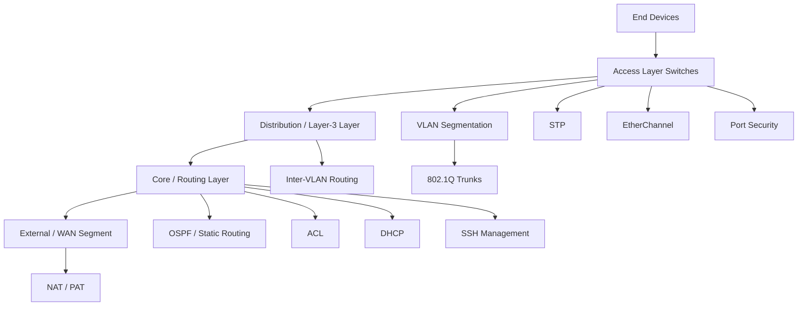
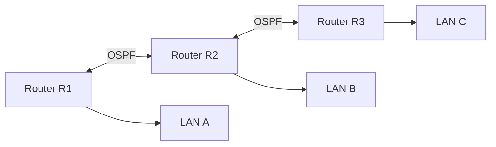
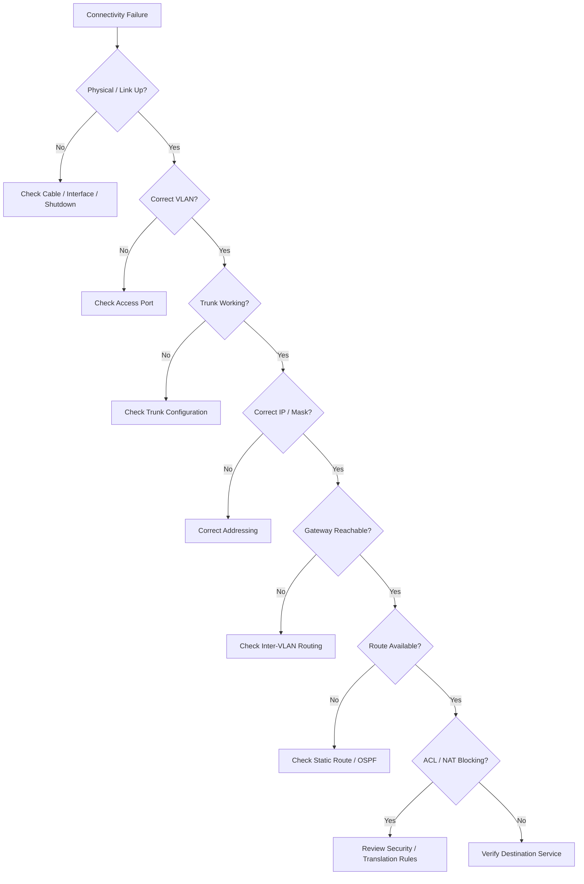

# CCNA Networking Project — Cisco Packet Tracer

> A practical CCNA networking laboratory built in **Cisco Packet Tracer**, covering enterprise LAN design, switching, routing, network services, security, troubleshooting, and verification.


---

## 📌 Project Overview

This repository documents my hands-on **CCNA networking project** developed and tested in Cisco Packet Tracer.

The objective of the project is to move beyond individual configuration exercises and build a structured network where multiple CCNA concepts work together:

- Network topology design
- IPv4 addressing and subnetting
- Switch configuration
- VLAN segmentation
- Access and trunk ports
- Inter-VLAN communication
- Router configuration
- Static and dynamic routing
- OSPF
- DHCP
- NAT/PAT
- Access Control Lists (ACLs)
- Layer-2 security
- SSH-based device management
- Spanning Tree Protocol
- EtherChannel
- IPv6 fundamentals
- End-device configuration
- Connectivity testing
- Troubleshooting and verification

The main Packet Tracer project file is:

```text
jesowin project.pkt
```

> **Important:** The `.pkt` file is the primary executable lab artifact. Screenshots in this README are intended to document the topology, configuration stages, and verification results.

---

# 🖥️ Project Screenshots

Store project screenshots inside:

```text
docs/
└── screenshots/
    ├── 01-topology.png
    ├── 02-device-addressing.png
    ├── 03-vlan-configuration.png
    ├── 04-trunking.png
    ├── 05-inter-vlan-routing.png
    ├── 06-routing.png
    ├── 07-dhcp.png
    ├── 08-security.png
    ├── 09-ssh.png
    ├── 10-ospf.png
    ├── 11-verification.png
    └── 12-final-topology.png
```

### Main Topology


### VLAN / Switching Configuration


### Routing Configuration


### Final Verification


> If a screenshot does not exist yet, take it directly from Packet Tracer and save it using the filenames above. GitHub will automatically render the images after they are committed.

---

# 🧠 Networking Concepts Implemented

| Area | Implementation | Purpose |
|---|---|---|
| Network Design | Multi-device topology | Represents a practical enterprise network |
| IPv4 | Subnetting and addressing | Logical host and network separation |
| Switching | Layer-2 switching | Local network communication |
| VLAN | Logical segmentation | Separates departments / user groups |
| Trunking | 802.1Q trunk links | Carries multiple VLANs |
| Inter-VLAN Routing | Router / Layer-3 routing | Enables communication between VLANs |
| STP | Spanning Tree | Prevents Layer-2 loops |
| EtherChannel | Link aggregation | Increases redundancy and bandwidth |
| Routing | Static / dynamic routing | Provides Layer-3 path selection |
| OSPF | Dynamic routing | Automatically learns internal routes |
| DHCP | Automatic addressing | Assigns IP configuration to clients |
| NAT/PAT | Address translation | Translates private networks toward external networks |
| ACL | Traffic filtering | Controls permitted and denied traffic |
| Port Security | Access-port protection | Restricts unauthorized devices |
| SSH | Secure administration | Provides encrypted remote management |
| IPv6 | IPv6 addressing | Introduces next-generation IP networking |
| Troubleshooting | CLI verification | Validates operational state |

---

# 🏗️ Network Architecture

The project follows a layered enterprise-network approach.



---

# 🔄 Complete Project Workflow

The network was designed using a staged implementation process rather than configuring everything at once.


### Implementation sequence

1. Analyze the network requirements.
2. Select routers, switches, servers, and end devices.
3. Build the physical/logical topology.
4. Create the IPv4/IPv6 addressing plan.
5. Configure basic device identity and management.
6. Configure switch access ports.
7. Create VLANs.
8. Configure trunk links.
9. Configure inter-VLAN routing.
10. Implement routing between network segments.
11. Configure OSPF where dynamic routing is required.
12. Configure DHCP and other required services.
13. Implement NAT/PAT where an external network is simulated.
14. Apply ACLs and Layer-2 security controls.
15. Configure STP/EtherChannel where required.
16. Configure SSH for secure management.
17. Test connectivity using `ping` and `traceroute`.
18. Verify routing and switching tables.
19. Troubleshoot failed paths.
20. Save the final Packet Tracer project.

---

# 1. 🔌 Physical and Logical Topology

The first stage is creating the topology in Cisco Packet Tracer.

### Devices

The lab can contain combinations of:

- Cisco routers
- Cisco Layer-2 switches
- Layer-3 switches where required
- PCs
- Servers
- WAN / cloud components where required

### Design objectives

The topology is designed so that:

- End devices connect to access switches.
- VLANs provide logical separation.
- Trunks carry multiple VLANs.
- Routers or Layer-3 devices provide inter-network communication.
- Routing protocols provide paths between Layer-3 networks.
- Security controls restrict unwanted traffic.
- Network services provide addressing and management support.

---

# 2. 🌐 IPv4 Addressing and Subnetting

A structured addressing plan is created before device configuration.

Example addressing model:

| Segment | Example Network | Mask | Gateway |
|---|---|---|---|
| Management | `192.168.10.0/24` | `255.255.255.0` | `192.168.10.1` |
| Users | `192.168.20.0/24` | `255.255.255.0` | `192.168.20.1` |
| Servers | `192.168.30.0/24` | `255.255.255.0` | `192.168.30.1` |
| Guest | `192.168.40.0/24` | `255.255.255.0` | `192.168.40.1` |

> The exact addressing plan should match the addresses visible in the final Packet Tracer topology.

### Skills demonstrated

- Network address identification
- Broadcast address calculation
- Host range calculation
- Default gateway selection
- Subnet mask selection
- Point-to-point addressing
- Route summarization concepts

---

# 3. 🔀 VLAN Implementation

VLANs divide a physical switch into logical broadcast domains.

Example:

```text
VLAN 10 → Management
VLAN 20 → Users
VLAN 30 → Servers
VLAN 40 → Guest
```

### Typical configuration

```cisco
enable
configure terminal

vlan 10
 name MANAGEMENT

vlan 20
 name USERS

vlan 30
 name SERVERS

vlan 40
 name GUEST

end
```

### Access-port assignment

```cisco
configure terminal

interface fastEthernet 0/1
 switchport mode access
 switchport access vlan 20

end
```

### Verification

```cisco
show vlan brief
```

Expected result:

- VLANs exist.
- Ports belong to the intended VLAN.
- End devices are isolated into their assigned broadcast domains.

---

# 4. 🚦 Trunking

Trunk links transport multiple VLANs between network devices.

### Example

```cisco
interface gigabitEthernet 0/1
 switchport mode trunk
```

Where supported, the allowed VLAN list can be explicitly controlled:

```cisco
switchport trunk allowed vlan 10,20,30,40
```

### Verification

```cisco
show interfaces trunk
```

### Workflow

```text
PC
 ↓
Access Port
 ↓
VLAN
 ↓
Trunk
 ↓
Router / Layer-3 Switch
 ↓
Destination VLAN
```

---

# 5. 🔁 Inter-VLAN Routing

VLANs are isolated at Layer 2. Inter-VLAN routing provides Layer-3 communication between them.

A router-on-a-stick design can use subinterfaces:

```cisco
interface gigabitEthernet 0/0
 no shutdown

interface gigabitEthernet 0/0.10
 encapsulation dot1Q 10
 ip address 192.168.10.1 255.255.255.0

interface gigabitEthernet 0/0.20
 encapsulation dot1Q 20
 ip address 192.168.20.1 255.255.255.0
```

### Verification

```cisco
show ip interface brief
show running-config
```

Then test from an endpoint:

```text
ping <destination-ip>
```

---

# 6. 🧭 Routing Implementation

Routing determines how packets travel between different IP networks.

## Static Routing

A static route can be configured using:

```cisco
ip route <destination-network> <subnet-mask> <next-hop>
```

Example:

```cisco
ip route 192.168.50.0 255.255.255.0 10.0.0.2
```

Verification:

```cisco
show ip route
```

## Default Routing

A default route provides a fallback path:

```cisco
ip route 0.0.0.0 0.0.0.0 <next-hop>
```

---

# 7. 🛰️ OSPF Dynamic Routing

OSPF is used to dynamically exchange routes between participating Layer-3 devices.

Example:

```cisco
router ospf 1
 router-id 1.1.1.1

 network 192.168.10.0 0.0.0.255 area 0
 network 10.0.0.0 0.0.0.3 area 0
```

### Verification

```cisco
show ip ospf neighbor
show ip ospf interface
show ip route ospf
show ip protocols
```

### OSPF workflow



### Expected result

```text
OSPF Neighbor
      ↓
LSA Exchange
      ↓
SPF Calculation
      ↓
Routing Table
      ↓
End-to-End Connectivity
```

---

# 8. 📡 DHCP Implementation

DHCP automatically provides IP configuration to clients.

Typical DHCP parameters:

- IP address
- Subnet mask
- Default gateway
- DNS server

Example:

```cisco
ip dhcp excluded-address 192.168.20.1 192.168.20.20

ip dhcp pool USERS
 network 192.168.20.0 255.255.255.0
 default-router 192.168.20.1
 dns-server 8.8.8.8
```

Verification:

```cisco
show ip dhcp binding
show ip dhcp pool
```

Client verification:

```text
Desktop → IP Configuration → DHCP
```

---

# 9. 🛡️ Access Control Lists

ACLs provide traffic filtering.

### Standard ACL

```cisco
access-list 10 permit 192.168.20.0 0.0.0.255
```

### Extended ACL

```cisco
access-list 100 permit ip 192.168.20.0 0.0.0.255 192.168.30.0 0.0.0.255
```

Apply to an interface:

```cisco
interface gigabitEthernet 0/0
 ip access-group 100 in
```

Verification:

```cisco
show access-lists
show running-config
```

### Security workflow

```text
Traffic
  ↓
ACL Evaluation
  ↓
Permit / Deny
  ↓
Forward or Drop
```

---

# 10. 🔐 Switch Port Security

Port security can restrict which devices are allowed on an access port.

Example:

```cisco
interface fastEthernet 0/1
 switchport mode access
 switchport port-security
 switchport port-security maximum 1
 switchport port-security violation restrict
 switchport port-security mac-address sticky
```

Verification:

```cisco
show port-security
show port-security interface fastEthernet 0/1
```

This demonstrates:

- MAC address control
- Unauthorized-device protection
- Sticky MAC learning
- Violation handling

---

# 11. 🌳 Spanning Tree Protocol

STP prevents switching loops when redundant Layer-2 paths exist.

Verification:

```cisco
show spanning-tree
```

Important concepts demonstrated:

- Root bridge
- Root port
- Designated port
- Blocking/discarding behavior
- Path cost
- Bridge ID
- STP convergence

Conceptual flow:

```text
Redundant Links
      ↓
STP Election
      ↓
Root Bridge
      ↓
Best Paths Selected
      ↓
Loop Prevention
```

---

# 12. 🔗 EtherChannel

EtherChannel combines multiple physical links into one logical link.

With LACP:

```cisco
interface range gigabitEthernet 0/1-2
 channel-group 1 mode active
```

Then configure the logical interface:

```cisco
interface port-channel 1
 switchport mode trunk
```

Verification:

```cisco
show etherchannel summary
show interfaces port-channel 1
```

Benefits:

- Higher aggregate bandwidth
- Link redundancy
- Simplified STP topology
- Logical management of multiple physical links

---

# 13. 🌍 NAT / PAT

NAT translates private addresses into another address space.

PAT allows multiple internal hosts to share a public address using port translation.

Conceptual architecture:

```text
Private LAN
192.168.x.x
     |
     v
[NAT Router]
     |
     v
Public / External Network
```

Typical verification:

```cisco
show ip nat translations
show ip nat statistics
```

---

# 14. 🔑 SSH Remote Management

SSH provides encrypted remote administration of Cisco devices.

Example configuration:

```cisco
hostname R1
ip domain-name ccna.local

username admin privilege 15 secret <password>

crypto key generate rsa modulus 1024

line vty 0 4
 login local
 transport input ssh
```

Verification:

```cisco
show ip ssh
show running-config
```

Management workflow:

```text
Administrator
     ↓
SSH Client
     ↓
Encrypted Session
     ↓
Cisco Device
     ↓
CLI Management
```

---

# 15. 🌐 IPv6

IPv6 configuration introduces 128-bit addressing and removes dependence on IPv4-only addressing.

Example:

```cisco
ipv6 unicast-routing

interface gigabitEthernet 0/0
 ipv6 address 2001:db8:10::1/64
 no shutdown
```

Verification:

```cisco
show ipv6 interface brief
show ipv6 route
```

Connectivity:

```text
ping <IPv6-address>
```

---

# 16. 🖥️ End-Device Configuration

PCs and servers are configured according to the network addressing plan.

Each endpoint requires, where applicable:

```text
IP Address
Subnet Mask
Default Gateway
DNS Server
```

Example:

```text
PC-A
IP:      192.168.20.10
Mask:    255.255.255.0
Gateway: 192.168.20.1
DNS:     8.8.8.8
```

The endpoint configuration must match the VLAN and Layer-3 gateway assigned to that segment.

---

# 17. 🧪 Network Verification

Configuration is not considered complete until the network has been tested.

## Basic connectivity

```text
ping <ip-address>
```

## Path verification

```text
tracert <ip-address>
```

or on Cisco IOS:

```cisco
traceroute <ip-address>
```

## Interface status

```cisco
show ip interface brief
```

## Routing table

```cisco
show ip route
```

## VLANs

```cisco
show vlan brief
```

## Trunks

```cisco
show interfaces trunk
```

## OSPF

```cisco
show ip ospf neighbor
show ip route ospf
```

## DHCP

```cisco
show ip dhcp binding
```

## NAT

```cisco
show ip nat translations
```

## ACL

```cisco
show access-lists
```

## STP

```cisco
show spanning-tree
```

## EtherChannel

```cisco
show etherchannel summary
```

## Port Security

```cisco
show port-security
```

---

# 🔍 Troubleshooting Methodology

The project follows a structured troubleshooting process.



---

# 🧰 Troubleshooting Checklist

- [ ] Check interface status with `show ip interface brief`
- [ ] Check VLAN membership
- [ ] Check trunk status
- [ ] Check IP addressing
- [ ] Check default gateway
- [ ] Check ARP information
- [ ] Check routing table
- [ ] Check OSPF neighbors
- [ ] Check ACL rules
- [ ] Check NAT translations
- [ ] Check STP state
- [ ] Check EtherChannel status
- [ ] Check port-security state
- [ ] Test hop-by-hop using `ping`
- [ ] Use `traceroute` when required
- [ ] Re-test after every corrective configuration

---

# 📊 Verification Matrix

| Test | Command / Method | Expected Result |
|---|---|---|
| Interfaces | `show ip interface brief` | Required interfaces are up/up |
| VLANs | `show vlan brief` | VLANs and access ports are correct |
| Trunks | `show interfaces trunk` | Required trunks are active |
| Routing | `show ip route` | Required routes exist |
| OSPF | `show ip ospf neighbor` | Neighbors reach FULL state |
| DHCP | `show ip dhcp binding` | Clients receive addresses |
| ACL | `show access-lists` | Counters reflect expected traffic |
| NAT | `show ip nat translations` | Translations appear when traffic is generated |
| STP | `show spanning-tree` | Loop-free topology |
| EtherChannel | `show etherchannel summary` | Port-channel is operational |
| Port Security | `show port-security` | Security state is active |
| IPv6 | `show ipv6 route` | IPv6 routes are present |
| End-to-End | `ping` | Destination is reachable |

---

# 📁 Recommended Repository Structure

```text
ccna-project/
│
├── README.md
├── jesowin project.pkt
│
├── docs/
│   ├── addressing-plan.md
│   ├── configuration-notes.md
│   ├── troubleshooting.md
│   │
│   └── screenshots/
│       ├── 01-topology.png
│       ├── 02-device-addressing.png
│       ├── 03-vlan-configuration.png
│       ├── 04-trunking.png
│       ├── 05-inter-vlan-routing.png
│       ├── 06-routing.png
│       ├── 07-dhcp.png
│       ├── 08-security.png
│       ├── 09-ssh.png
│       ├── 10-ospf.png
│       ├── 11-verification.png
│       └── 12-final-topology.png
│
└── configs/
    ├── R1.txt
    ├── R2.txt
    ├── SW1.txt
    └── SW2.txt
```

---

# 🚀 How to Run the Project

## 1. Install Cisco Packet Tracer

Install Cisco Packet Tracer on your system.

## 2. Clone the repository

```bash
git clone <your-github-repository-url>
cd <repository-name>
```

## 3. Open the Packet Tracer project

Open:

```text
jesowin project.pkt
```

using Cisco Packet Tracer.

## 4. Inspect the topology

Start from the physical topology and identify:

```text
Routers
Switches
Servers
PCs
Links
VLANs
WAN connections
```

## 5. Verify device configuration

Open the CLI of each Cisco device and run the appropriate `show` commands listed in this README.

## 6. Perform connectivity tests

Test:

```text
PC → Gateway
PC → Same VLAN Host
PC → Different VLAN
Router → Router
LAN → Remote Network
LAN → External Network
```

## 7. Save the final lab

After validation, save the Packet Tracer file.

---

# 🎯 Learning Outcomes

This project strengthened practical understanding of:

### Switching

- VLANs
- Access ports
- Trunk ports
- 802.1Q
- STP
- EtherChannel
- Port security
- MAC learning

### Routing

- IPv4 addressing
- Subnetting
- Static routes
- Default routes
- Dynamic routing
- OSPF
- Inter-VLAN routing
- IPv6 routing

### Network Services

- DHCP
- DNS concepts
- NAT
- PAT
- Server connectivity

### Security

- Standard ACLs
- Extended ACLs
- Port security
- SSH
- Device management

### Troubleshooting

- Interface-state analysis
- VLAN/trunk troubleshooting
- IP addressing validation
- Routing-table analysis
- OSPF neighbor verification
- End-to-end connectivity testing

---

# 💡 Key Practical Skills Demonstrated

The project demonstrates that networking configuration is not only about entering Cisco IOS commands.

The complete engineering workflow is:

```text
PLAN
 ↓
DESIGN
 ↓
ADDRESS
 ↓
CONFIGURE
 ↓
ROUTE
 ↓
SECURE
 ↓
VERIFY
 ↓
TROUBLESHOOT
 ↓
DOCUMENT
```

This approach mirrors how a network engineer approaches a real network rather than treating each CCNA topic as an isolated command exercise.

---

# 📝 Project Documentation Standard

For every major implementation, documentation should answer four questions:

### 1. What was implemented?

Example:

```text
VLAN segmentation was implemented to separate users
into independent Layer-2 broadcast domains.
```

### 2. Why was it implemented?

```text
Segmentation reduces unnecessary broadcast traffic
and provides logical separation between departments.
```

### 3. How was it implemented?

```text
VLANs were created on the switches and access/trunk
ports were assigned according to the topology.
```

### 4. How was it verified?

```text
show vlan brief
show interfaces trunk
ping
```

This makes the project documentation useful for both academic evaluation and a networking portfolio.

---

# 🏆 Final Project Validation

Before considering the project complete:

```text
✓ Topology is correctly connected
✓ Device interfaces are operational
✓ VLANs are correctly assigned
✓ Trunks are operational
✓ Inter-VLAN routing works
✓ Required routes are present
✓ OSPF neighbors are established where used
✓ DHCP clients receive valid addressing
✓ NAT/PAT works where configured
✓ ACLs enforce the intended policy
✓ Port security is operational where configured
✓ STP prevents Layer-2 loops
✓ EtherChannel is operational where configured
✓ SSH management works where configured
✓ IPv6 connectivity works where configured
✓ End-to-end connectivity is verified
✓ Packet Tracer project is saved
✓ Screenshots document the major implementation stages
```

---

# 📷 Recommended Screenshot Workflow

For a professional GitHub portfolio, capture screenshots in this order:

### Screenshot 01 — Complete Topology

Show the entire Packet Tracer workspace.

```text
docs/screenshots/01-topology.png
```

### Screenshot 02 — Addressing

Show the IP configuration and addressing plan.

```text
docs/screenshots/02-device-addressing.png
```

### Screenshot 03 — VLANs

Show:

```cisco
show vlan brief
```

```text
docs/screenshots/03-vlan-configuration.png
```

### Screenshot 04 — Trunks

Show:

```cisco
show interfaces trunk
```

```text
docs/screenshots/04-trunking.png
```

### Screenshot 05 — Inter-VLAN Routing

Show subinterfaces or Layer-3 interfaces and successful pings.

```text
docs/screenshots/05-inter-vlan-routing.png
```

### Screenshot 06 — Routing

Show:

```cisco
show ip route
```

```text
docs/screenshots/06-routing.png
```

### Screenshot 07 — DHCP

Show DHCP bindings and a client receiving an address.

```text
docs/screenshots/07-dhcp.png
```

### Screenshot 08 — Security

Show ACL / port-security configuration and verification.

```text
docs/screenshots/08-security.png
```

### Screenshot 09 — SSH

Show successful SSH configuration/verification.

```text
docs/screenshots/09-ssh.png
```

### Screenshot 10 — OSPF

Show:

```cisco
show ip ospf neighbor
```

and:

```cisco
show ip route ospf
```

```text
docs/screenshots/10-ospf.png
```

### Screenshot 11 — Verification

Show successful end-to-end connectivity.

```text
docs/screenshots/11-verification.png
```

### Screenshot 12 — Final Topology

Show the final complete network.

```text
docs/screenshots/12-final-topology.png
```

---

# 👨‍💻 Author

**Jesowin Raja**

Networking / Cloud Networking Enthusiast  
Hands-on experience with Cisco Packet Tracer, routing, switching, Linux, servers, and network infrastructure.

---

# 📚 References

- Cisco Packet Tracer
- Cisco Networking Academy / CCNA learning material
- Cisco IOS command-line documentation
- RFC-based IPv4 / IPv6 networking concepts

---

## ⭐ Portfolio Note

This project is intended to demonstrate **hands-on networking ability**, including topology design, Cisco IOS configuration, routing and switching, network services, security controls, verification, and troubleshooting.

The `.pkt` file provides the practical lab environment, while this README explains the engineering workflow and the reasoning behind the individual networking implementations.
