<p align="center">
  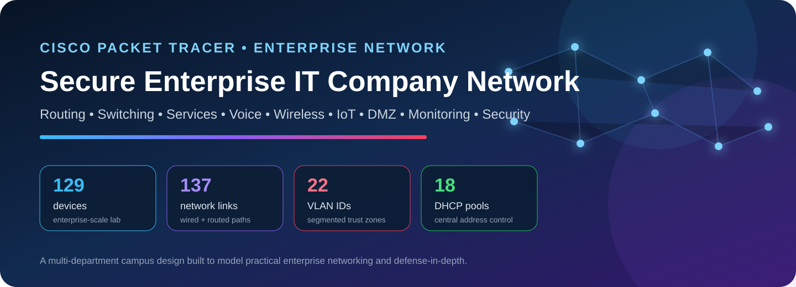
</p>

<p align="center">
  
  
  
  
  
  
  
  
</p>

# Secure Enterprise IT Company Network

I designed and implemented this Cisco Packet Tracer project as a **multi-department enterprise campus network**, not as a single-router classroom topology. My goal was to model how a real IT company separates business units, centralizes shared services, keeps public-facing systems away from internal users, supports voice/wireless/IoT, maintains alternate routed paths, and applies security controls at multiple layers of the network.

The environment combines a **six-router OSPF core**, **19 Cisco 2960 switches**, **22 VLAN IDs**, **centralized DHCP/DNS/web/file services**, a **DMZ**, **operations/monitoring**, **Cisco CME IP telephony**, **controller-based wireless**, **IoT segmentation**, **IPv4/IPv6 ACLs**, **port security**, **DHCP snooping**, **Dynamic ARP Inspection**, **STP/PortFast**, and an **eight-link LACP EtherChannel**.

> **Repository note:** This repository documents my project as an engineering/portfolio artifact. Public documentation and configuration copies do not expose password, PSK or SNMP secret values from the lab file.

---

## Table of contents

1. [Project at a glance](#project-at-a-glance)
2. [What problem this network solves](#what-problem-this-network-solves)
3. [Full project topology](#full-project-topology)
4. [Enterprise architecture](#enterprise-architecture)
5. [Hardware and device inventory](#hardware-and-device-inventory)
6. [Router and switch roles](#router-and-switch-roles)
7. [VLAN and IP addressing architecture](#vlan-and-ip-addressing-architecture)
8. [Routing architecture — why OSPF](#routing-architecture--why-ospf)
9. [Switching architecture](#switching-architecture)
10. [Department and business-unit design](#department-and-business-unit-design)
11. [Centralized enterprise services](#centralized-enterprise-services)
12. [DHCP architecture](#dhcp-architecture)
13. [DNS, web and file services](#dns-web-and-file-services)
14. [Voice / Cisco CME architecture](#voice--cisco-cme-architecture)
15. [Wireless architecture](#wireless-architecture)
16. [IoT architecture](#iot-architecture)
17. [DMZ and public-service architecture](#dmz-and-public-service-architecture)
18. [Operations and monitoring](#operations-and-monitoring)
19. [Security architecture](#security-architecture)
20. [End-to-end traffic flows](#end-to-end-traffic-flows)
21. [Availability and resiliency](#availability-and-resiliency)
22. [Why each technology is used](#why-each-technology-is-used)
23. [How this differs from a flat network](#how-this-differs-from-a-flat-network)
24. [How this compares with modern enterprise architecture](#how-this-compares-with-modern-enterprise-architecture)
25. [Production hardening roadmap](#production-hardening-roadmap)
26. [Known saved-state issues](#known-saved-state-issues)
27. [Implementation journey](#implementation-journey)
28. [Validation and test approach](#validation-and-test-approach)
29. [Skills demonstrated](#skills-demonstrated)
30. [Repository structure](#repository-structure)
31. [Opening and reviewing the project](#opening-and-reviewing-the-project)
32. [Project conclusion](#project-conclusion)

---

## Project at a glance

| Metric | Value |
| --- | ---: |
| Packet Tracer project version | `9.0.0.0810` |
| Total devices | **129** |
| Total links | **137** |
| IOS devices with saved running configurations | **26** |
| Routers | **7** |
| Switches | **19** |
| Servers | **9** |
| PCs | **52** |
| Laptops | **8** |
| Printers | **10** |
| IP phones | **10** |
| IoT devices | **6** |
| Wireless infrastructure | **2** — WLC + LAP |
| Distinct VLAN IDs used | **22** |
| Central DHCP pools | **18** |
| Direct router-to-router core links | **15** |
| Cisco CME directory numbers | **10** |
| Saved CLI command-history records | **3426** |
| Configuration activity period | **2026-06-10 → 2026-07-27** |

### What is implemented

- Multi-router **OSPF Area 0** core with many alternate routed paths.
- **Router-on-a-stick** inter-VLAN routing for multiple enterprise access blocks.
- Dedicated department networks for executives, HR, Finance, Sales, IT Helpdesk, Cloud Infrastructure, Software Engineering, Cybersecurity, NOC, Media and other business units.
- **Central DHCP** with `ip helper-address` relays instead of one DHCP server per VLAN.
- Central **DNS**, internal web, file and IoT registration services.
- A dedicated **DMZ** for public web and email services.
- **IPv6** addressing and filtering on VLAN 116.
- Cisco **CME / IP telephony** with voice VLAN 80 and ten configured directory numbers.
- **WLC + lightweight access point** architecture for centralized wireless control.
- Separate **IoT** segments rather than placing smart devices in normal user VLANs.
- **ACL-based policy** for sensitive HR/Finance/DMZ/IoT traffic.
- **Port security**, **DHCP snooping** and **Dynamic ARP Inspection** on the protected HR/Finance access switch.
- **LACP EtherChannel** between Switch3 and Switch4.
- **Syslog/SNMP-style monitoring** in the operations segment.
- STP/PVST and **PortFast** on edge ports.

---

## What problem this network solves

A real company network cannot safely operate as one large broadcast domain where every laptop, printer, server, IP phone and IoT device can freely reach every other device. Different systems have different business value, threat levels and availability requirements.

I built this topology around the following real enterprise problems:

| Business / technical problem | Design response in this project |
| --- | --- |
| HR and Finance contain sensitive information | Separate VLANs plus routed ACL policy |
| Engineering and NOC need their own operational networks | Dedicated Cloud, Software Engineering, Cybersecurity and NOC VLANs |
| Users need automatic addressing across many subnets | Central DHCP + router DHCP relay |
| Internal applications need stable names | Dedicated internal DNS server |
| Public services must not sit directly beside employee PCs | Separate DMZ VLAN 998 |
| Voice traffic should be separated from workstation traffic | Dedicated voice VLAN and Cisco CME gateway |
| Wireless should be centrally controlled | WLC + lightweight AP + management VLAN 110 |
| IoT devices have a different trust level from users | Dedicated IoT VLANs and an IoT ACL policy |
| Rogue DHCP / ARP spoofing can attack local networks | DHCP snooping + Dynamic ARP Inspection on sensitive access VLANs |
| Access ports should not accept unlimited unknown devices | Sticky MAC port security with violation restriction |
| A single routed link should not define the whole network | Highly interconnected OSPF core |
| Multiple physical switch links should operate as one logical uplink | LACP EtherChannel |
| Operations teams need visibility | Monitoring subnet, logging target and SNMP configuration |

The result is a network that behaves more like a **small enterprise campus / multi-department IT company** than a basic lab.

---

## Full project topology

<p align="center">
  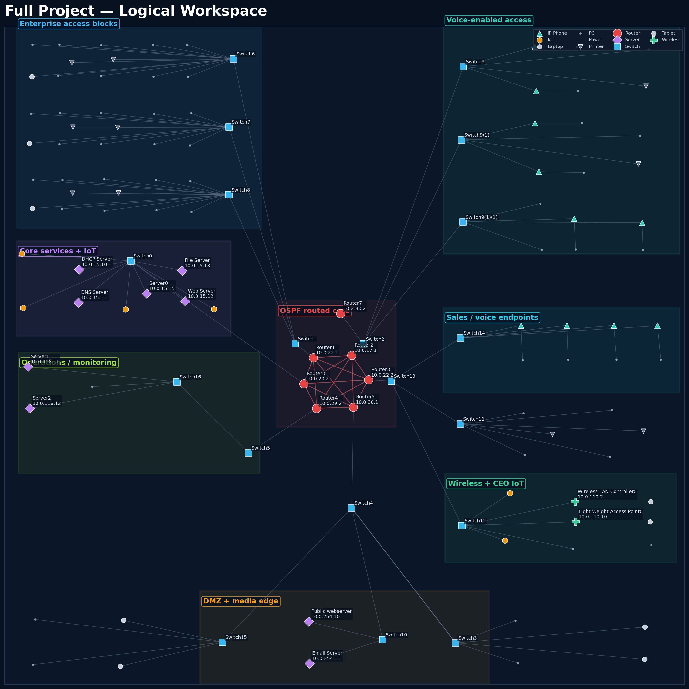
</p>

The full logical workspace contains **129 devices and 137 links**. I separated the topology into functional zones so that the design is easier to reason about operationally:

- **Corporate access blocks** — general business departments carried through Switch6/7/8 and Router1.
- **Core services + IoT** — DHCP, DNS, internal web, file, IoT registration and VLAN 100 behind Router0.
- **OSPF routed core** — six Cisco 1941 routers connected with 15 direct inter-router links.
- **Technical and voice access** — Cloud Infrastructure, Software Engineering, Cybersecurity, NOC and voice-enabled endpoints behind Router2.
- **Sensitive business access** — Sales, HR, Finance, CEO data, CEO IoT and wireless management behind Router3.
- **Operations / monitoring** — management-facing server network behind Router4.
- **Media / IPv6 / DMZ edge** — media endpoints, IPv6 R&D and public services behind Router5.
- **Cisco CME voice gateway** — Router7 attached to the voice segment.

### Subsystem screenshots

<table>
<tr>
<td width="50%">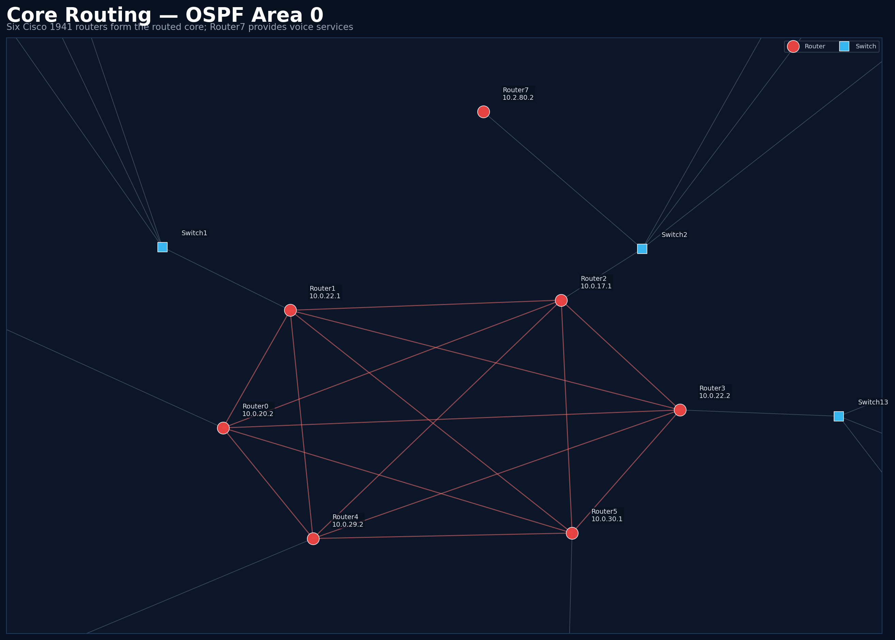<br/><sub><b>OSPF core:</b> six routed core devices plus the voice gateway connection.</sub></td>
<td width="50%">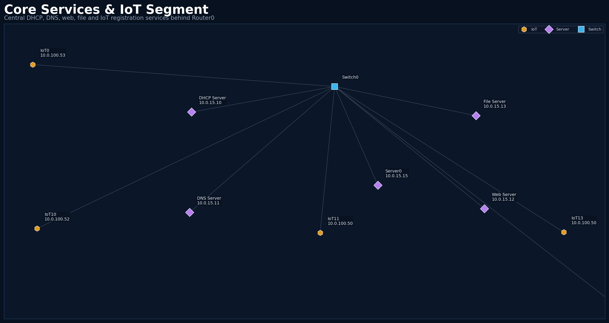<br/><sub><b>Core services:</b> DHCP, DNS, web, file, IoT registration and IoT endpoints.</sub></td>
</tr>
<tr>
<td width="50%">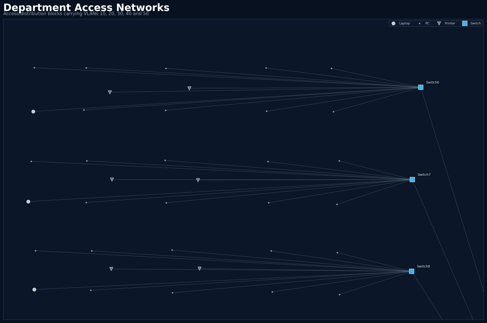<br/><sub><b>Corporate access:</b> three access switches carrying department VLANs 10/20/30/40/50.</sub></td>
<td width="50%">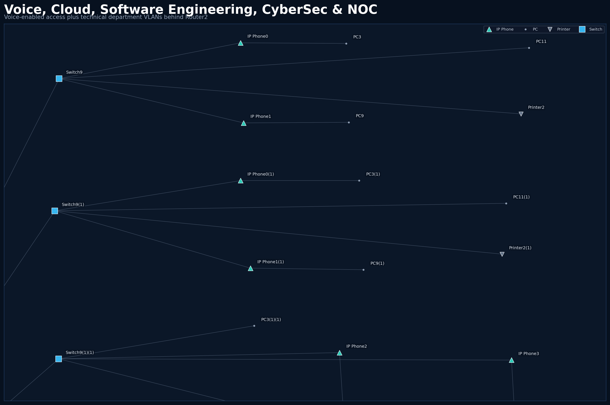<br/><sub><b>Technical + voice:</b> Cloud, Software Engineering, Cybersecurity, NOC and IP phones.</sub></td>
</tr>
<tr>
<td width="50%">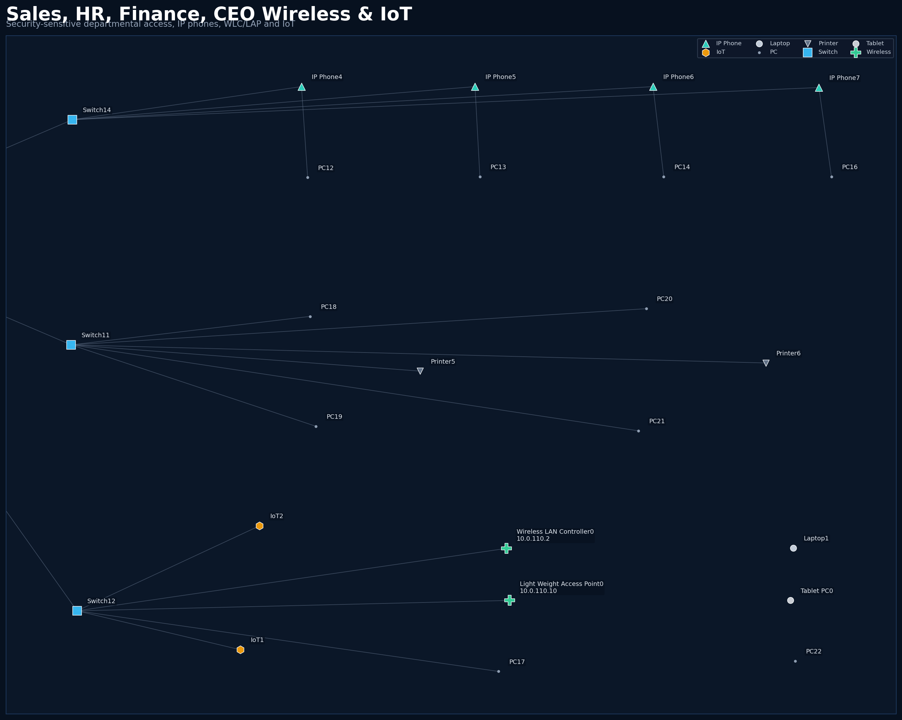<br/><sub><b>Business security zone:</b> Sales, HR, Finance, CEO wireless and IoT.</sub></td>
<td width="50%">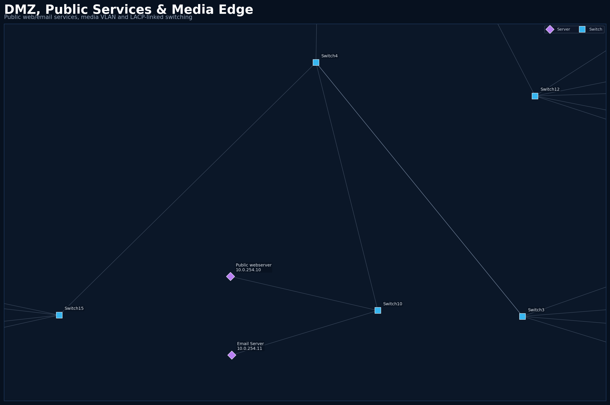<br/><sub><b>DMZ/media edge:</b> public services, media VLAN and EtherChannel-linked switches.</sub></td>
</tr>
<tr>
<td width="50%">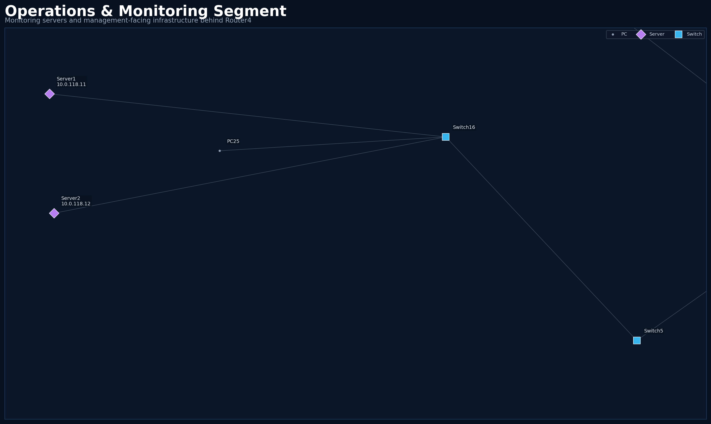<br/><sub><b>Operations:</b> monitoring servers and management-facing infrastructure.</sub></td>
<td width="50%">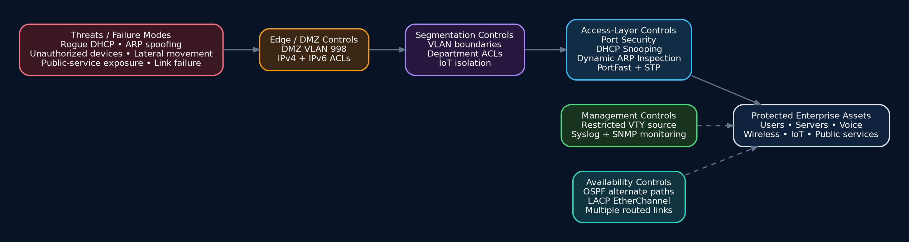<br/><sub><b>Security view:</b> the controls used to reduce different network threats.</sub></td>
</tr>
</table>

---

## Enterprise architecture

<p align="center">
  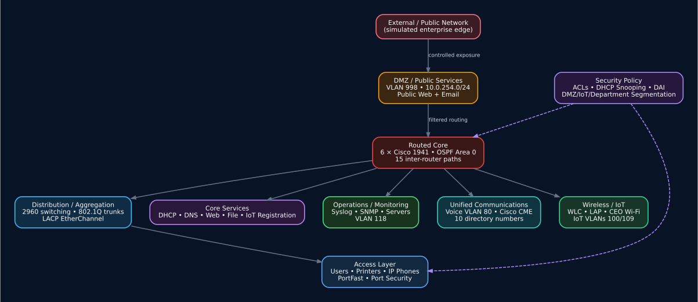
</p>

I structured the project around several enterprise design principles.

### 1. Separate forwarding domains

Department VLANs reduce unnecessary broadcasts and give me a clean place to enforce access policy. HR, Finance, voice, wireless management, IoT and DMZ traffic do not share one flat Layer-2 domain.

### 2. Route between trust zones

When traffic crosses from one VLAN/subnet to another, it reaches a router. That creates a policy boundary where ACLs, DHCP relay and routing decisions can be applied.

### 3. Centralize common services

DHCP, DNS, web, file and IoT registration are centralized in the `10.0.15.0/24` core-services network. This avoids duplicating infrastructure in every department.

### 4. Separate public and private services

The public web server and email server are placed in `10.0.254.0/24` rather than directly inside an employee subnet. Router5 applies DMZ policy before traffic can move toward internal networks.

### 5. Build alternate paths

The six 1941 routers form a dense OSPF mesh. The design demonstrates dynamic reconvergence: routing is not dependent on one static next hop.

### 6. Protect the access layer

Switch11 demonstrates access-layer security controls where attacks often begin: port security, DHCP snooping and Dynamic ARP Inspection.

### 7. Treat voice, wireless and IoT as separate infrastructure domains

Voice has its own VLAN and CME gateway, wireless has a dedicated controller-management network, and IoT devices are separated from normal employee clients.

---

## Hardware and device inventory

| Device class | Count |
| --- | --- |
| Routers | 7 |
| Switches | 19 |
| Servers | 9 |
| PCs | 52 |
| Laptops | 8 |
| Printers | 10 |
| IP phones | 10 |
| IoT devices | 6 |
| Wireless devices | 2 |
| Tablet | 1 |
| Power devices | 5 |

### Why these device types matter

- **Cisco 1941 routers** model the enterprise routed core and inter-VLAN routing boundaries.
- **Cisco 2960 switches** model Layer-2 access/distribution behavior such as VLANs, trunks, STP, PortFast, port security and EtherChannel.
- **Cisco 2811 voice gateway** provides CME/telephony functionality in Packet Tracer.
- **Servers** represent the shared infrastructure an IT department must operate.
- **PCs/laptops/printers** model ordinary enterprise endpoints and user-facing access ports.
- **IP phones** demonstrate voice/data coexistence and voice VLAN design.
- **WLC/LAP** demonstrate centralized enterprise wireless rather than independent consumer APs.
- **IoT endpoints** represent lower-trust smart devices that should not be placed in ordinary user networks.

The complete device and link inventory is available in [`docs/DEVICE_INVENTORY.md`](docs/DEVICE_INVENTORY.md) and in machine-readable CSV form under [`data/`](data/).

---

## Router and switch roles

### Router roles

| Device | Model | Primary role | Networks terminated | Why it exists |
| --- | --- | --- | --- | --- |
| Router0 | Cisco 1941 | Core services + IoT gateway | 10.0.15.0/24, VLAN 100 | Central services gateway, IoT relay, OSPF core member |
| Router1 | Cisco 1941 | Corporate department gateway | VLANs 10, 20, 30, 40, 50 | Execs, HR, Finance, Sales and IT Helpdesk access block |
| Router2 | Cisco 1941 | Technical departments + voice routing | VLANs 70, 75, 80, 98, 99 | Cloud Infrastructure, Software Engineering, Voice, Cybersecurity and NOC |
| Router3 | Cisco 1941 | Sensitive business + wireless aggregation | VLANs 10, 20, 30, 105–110 | Sales, HR, Finance, CEO, wireless management and IoT policy point |
| Router4 | Cisco 1941 | Business-unit + operations gateway | VLANs 1, 10, 20, 30, 118 | Additional business subnets plus monitoring/operations segment |
| Router5 | Cisco 1941 | Media, IPv6 and DMZ edge | VLANs 115, 116, 998 | Media team, IPv6 R&D segment and public-service DMZ |
| Router7 | Cisco 2811 | Cisco CME voice gateway | 10.2.80.2/24 | Call control / telephony-service with 10 directory numbers |

### Switch roles

| Switch / group | Role | What it connects or protects |
| --- | --- | --- |
| Switch0 | Core-services access | DHCP, DNS, web, file, IoT registration and IoT VLAN 100 |
| Switch1 | Corporate distribution | Aggregates Switch6/7/8 and trunks VLANs 10/20/30/40/50 to Router1 |
| Switch6 / 7 / 8 | Corporate access | Execs, HR, Finance, Sales and IT Helpdesk endpoints |
| Switch2 | Technical distribution + voice | Aggregates cloud/software/CyberSec/NOC access blocks and voice gateway |
| Switch9 / 9(1) / 9(1)(1) | Technical access | Cloud Infrastructure, Software Engineering, Cybersecurity/NOC and voice-enabled endpoints |
| Switch13 | Sensitive-department distribution | Aggregates Sales, HR/Finance and CEO wireless/IoT networks to Router3 |
| Switch14 | Sales access | Sales data VLAN 105 + voice VLAN 106 |
| Switch11 | HR/Finance secured access | VLANs 107/108 with port security, DHCP snooping and Dynamic ARP Inspection |
| Switch12 | CEO / wireless / IoT access | CEO data, WLC management and CEO IoT connectivity |
| Switch5 + Switch16 | Operations/monitoring | Monitoring servers and management-facing endpoints on VLAN 118 |
| Switch4 + Switch3 | Media aggregation | Eight-link LACP EtherChannel carrying VLAN 115; connects DMZ and IPv6 edge switches |
| Switch10 | DMZ access | Public web and email servers on VLAN 998 |
| Switch15 | IPv6/R&D access | IPv6 VLAN 116 endpoint block; saved trunk/access intent needs review |

### Why I used multiple routers instead of one large router

A single router would be simpler, but it would hide important enterprise concepts. Multiple routed nodes allow the project to demonstrate:

- dynamic routing and route convergence;
- point-to-point addressing;
- alternate paths and failure domains;
- the difference between a routed core and Layer-2 access;
- location/business-unit boundaries;
- more realistic troubleshooting with `show ip route`, OSPF state, interface status and path selection.

In a modern campus, much of this routing would often occur on redundant Layer-3 switches or inside an SD-Access fabric rather than six standalone WAN-style routers. The underlying concepts—segmentation, routed boundaries, an IGP and redundant paths—remain directly relevant.

---

## VLAN and IP addressing architecture

I use private RFC1918 `10.0.0.0/8` space and divide it into smaller subnet blocks. Most department networks are `/24`, giving a clear boundary and sufficient host capacity for a lab-sized department. Most point-to-point transit links are intended to be `/30`, which is a traditional way to allocate two usable IPv4 addresses to a router-to-router link.

### VLAN/subnet map

| Routing domain | VLAN | Role | Subnet | Gateway | Purpose |
| --- | --- | --- | --- | --- | --- |
| Router0 domain | 100 | IoT devices | 10.0.100.0/24 | 10.0.100.1 | Central IoT segment; DHCP-relayed to 10.0.15.10 |
| Router1 domain | 10 | Execs | 10.0.10.0/24 | 10.0.10.1 | Executive/business users |
| Router1 domain | 20 | HR | 10.0.200.0/24 | 10.0.200.1 | HR user segment |
| Router1 domain | 30 | Finance | 10.0.201.0/24 | 10.0.201.1 | Finance user segment |
| Router1 domain | 40 | Sales | 10.0.40.0/24 | 10.0.40.1 | Sales user segment |
| Router1 domain | 50 | IT Helpdesk | 10.0.50.0/24 | 10.0.50.1 | IT/support user segment |
| Router2 domain | 70 | Cloud Infrastructure | 10.2.9.0/24 | 10.2.9.1 | Cloud/infrastructure engineering |
| Router2 domain | 75 | Software Engineering | 10.2.10.0/24 | 10.2.10.1 | Software engineering users |
| Router2 domain | 80 | Voice | 10.2.80.0/24 | 10.2.80.1 | IP telephony / Cisco CME |
| Router2 domain | 98 | Cybersecurity | 10.2.11.0/24 | 10.2.11.1 | Cybersecurity team |
| Router2 domain | 99 | NOC | 10.2.12.0/24 | 10.2.12.1 | Network Operations Center |
| Router3 domain | 10 | Business subnet | 10.3.10.0/24 | 10.3.10.1 | Additional user/business network |
| Router3 domain | 20 | Business subnet | 10.3.20.0/24 | 10.3.20.1 | Additional user/business network |
| Router3 domain | 30 | CEO Data | 10.3.30.0/24 | 10.3.30.1 | CEO / executive data network |
| Router3 domain | 105 | Sales Data | 10.0.105.0/24 | 10.0.105.1 | Sales workstation/data network |
| Router3 domain | 106 | Sales Voice | 10.0.106.0/24 | 10.0.106.1 | Sales voice addressing |
| Router3 domain | 107 | HR Department | 10.0.107.0/24 | 10.0.107.1 | Restricted HR segment |
| Router3 domain | 108 | Finance Department | 10.0.108.0/24 | 10.0.108.1 | Restricted Finance segment |
| Router3 domain | 109 | CEO IoT | 10.0.109.0/24 | 10.0.109.1 | Executive IoT trust zone |
| Router3 domain | 110 | WLC Management | 10.0.110.0/24 | 10.0.110.1 | Wireless controller / LAP management |
| Router4 domain | 1 | Native / local segment | 10.0.14.0/24 | 10.0.14.1 | Local routed/native segment |
| Router4 domain | 10 | Business subnet | 10.5.10.0/24 | 10.5.10.1 | Additional business-unit subnet |
| Router4 domain | 20 | Business subnet | 10.5.20.0/24 | 10.5.20.1 | Additional business-unit subnet |
| Router4 domain | 30 | Business subnet | 10.5.30.0/24 | 10.5.30.1 | Additional business-unit subnet |
| Router4 domain | 118 | Operations / Monitoring | 10.0.118.0/24 | 10.0.118.1 | Monitoring servers and management services |
| Router5 domain | 115 | Media Team | 10.0.115.0/24 | 10.0.115.1 | Media/creative endpoints |
| Router5 domain | 116 | IPv6 R&D | 2001:DB8:ACAD:116::/64 | 2001:DB8:ACAD:116::1 | IPv6-focused segment with IPv6 ACL |
| Router5 domain | 998 | DMZ External | 10.0.254.0/24 | 10.0.254.1 | Public web and email services |

### Why the same VLAN number appears in more than one routed domain

VLAN IDs such as `10`, `20` and `30` are reused in separate Layer-2 domains. This is technically valid because the trunks are not one continuous Layer-2 fabric; each router terminates a separate broadcast domain with a different IP subnet.

For example:

- Router1 VLAN 10 → `10.0.10.0/24`
- Router3 VLAN 10 → `10.3.10.0/24`
- Router4 VLAN 10 → `10.5.10.0/24`

In a larger production organization I would normally standardize VLAN numbering and naming more strictly, or move to VRFs/virtual networks so that the policy model is easier to automate and audit.

### Why `/24` for departments

A `/24` is easy to understand and troubleshoot, supports up to 254 usable IPv4 addresses, and keeps broadcast domains manageable. In production I would size each subnet from real endpoint counts rather than automatically assigning `/24` everywhere.

### Why `/30` for transit links

A point-to-point router link needs only two endpoints, so `/30` minimizes wasted address space and makes the topology obvious. Modern routed links may also use `/31` where supported. In this saved project, five Router0-facing transit interfaces have a `/24` mask while their peers use `/30`; that is listed later as a correction item.

---

## Routing architecture — why OSPF

<p align="center">
  
</p>

The six Cisco 1941 routers participate in **OSPF process 1, Area 0**. There are **15 direct router-to-router links**, creating multiple paths through the core.

### Why I chose OSPF

OSPF fits an enterprise-style lab because it provides capabilities that static routing cannot provide cleanly at this size:

- **automatic route exchange** between routers;
- **shortest-path calculation** from link-state information;
- **convergence after topology changes**;
- support for many routed subnets without manually maintaining a static route on every router;
- vendor-neutral industry relevance;
- clear troubleshooting with routing tables, OSPF neighbors, LSDB concepts and router IDs.

### Why not only static routes

Static routes are useful for small, stable designs and I still use a default route on the voice gateway, but a 6-router core with many VLAN networks would require a large number of manually maintained routes. One topology change could require changes on multiple routers.

### Why not RIP

RIP is simpler but has a small hop-count metric and slower/less scalable behavior. It is useful for learning distance-vector concepts, but OSPF is a better fit for this enterprise scenario.

### Why not EIGRP as the main protocol

EIGRP is capable and fast, but I used OSPF because it is broadly standardized and maps well to multi-vendor enterprise concepts.

### Router IDs present

- Router2 → `2.2.2.2`
- Router3 → `3.3.3.3`
- Router5 → `4.4.4.4`
- Router4 → `5.5.5.5`
- Router7 → `9.9.9.9`
- Router0/Router1 rely on automatic router-ID selection in the saved configuration.

### Resiliency concept

<p align="center">
  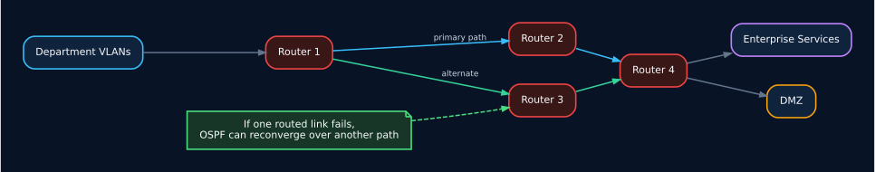
</p>

The point of the mesh is not that every enterprise should physically cable routers exactly this way. The point is to demonstrate **multiple possible paths and dynamic route selection**. In production, redundancy is normally designed around dual core/distribution devices, redundant uplinks, equal-cost paths, first-hop redundancy and carefully engineered failure domains.

---

## Switching architecture

The switching layer carries user/device VLANs to the correct gateway and enforces important Layer-2 behavior.

### 802.1Q trunks

I use trunks where one physical connection must carry multiple VLANs. This is essential between distribution/access switches and router-on-a-stick interfaces.

**Why:** without trunking, each VLAN would need a separate physical cable/interface, which is inefficient and does not scale.

### Access ports

Endpoints are connected through access ports assigned to a single data VLAN. IP phone ports additionally use a voice VLAN where configured.

**Why:** an endpoint should not normally be able to choose arbitrary VLAN tags and enter other trust zones.

### STP / PVST

The switches run PVST-style spanning tree.

**Why:** redundant Layer-2 paths can create Ethernet loops, broadcast storms and MAC-table instability. STP prevents a loop from taking down a broadcast domain.

### PortFast

PortFast is enabled on many endpoint-facing ports.

**Why:** ordinary PCs, printers and phones do not create switch-to-switch loops, so they can move to forwarding state quickly instead of waiting through the normal STP transition.

### LACP EtherChannel

Switch3 and Switch4 are connected by eight physical FastEthernet links assigned to **Port-channel1** with `channel-group 1 mode active`.

**Why I used it:**

- combines multiple physical links into one logical Layer-2 channel;
- increases aggregate bandwidth;
- provides link-level redundancy;
- lets STP treat the bundle as one logical path instead of blocking each parallel connection independently;
- demonstrates a common data-center/campus aggregation concept.

### Port security

Switch11 uses sticky MAC learning, a maximum device count and `violation restrict` on HR/Finance access ports.

**Why:** it reduces the chance that an arbitrary device can be plugged into a sensitive access port and immediately become a normal network participant.

**Production limitation:** MAC-based port security is not identity. A current enterprise would usually add **802.1X/MAB with NAC** so policy follows a user/device identity rather than only a learned MAC address.

### DHCP snooping

Switch11 enables DHCP snooping for VLANs 107–108 and trusts the uplink.

**Why:** it blocks untrusted access ports from acting as rogue DHCP servers and distributing malicious gateways/DNS settings.

### Dynamic ARP Inspection

DAI is enabled for VLANs 107–108 with the uplink trusted.

**Why:** ARP is unauthenticated by design. DAI uses trusted DHCP binding information to reduce ARP spoofing/poisoning attacks on the local VLAN.

---

## Department and business-unit design

### Corporate departments — Router1 / Switch1 / Switch6–8

<p align="center"></p>

This block models a traditional office environment with separate networks for:

- VLAN 10 — **Execs**
- VLAN 20 — **HR**
- VLAN 30 — **Finance**
- VLAN 40 — **Sales**
- VLAN 50 — **IT Helpdesk**

Three access switches feed Switch1, which then trunks the VLANs to Router1. This gives me a clean demonstration of access → distribution → routed gateway behavior.

### Technical departments — Router2 / Switch2

<p align="center"></p>

Router2 is the technical-services side of the enterprise:

- VLAN 70 — **Cloud Infrastructure** (`10.2.9.0/24`)
- VLAN 75 — **Software Engineering** (`10.2.10.0/24`)
- VLAN 80 — **Voice** (`10.2.80.0/24`)
- VLAN 98 — **Cybersecurity** (`10.2.11.0/24`)
- VLAN 99 — **NOC** (`10.2.12.0/24`)

This mirrors a real IT organization where engineering, security and operations teams may require separate broadcast/policy domains even though all of them are technical users.

### Sensitive departments — Router3 / Switch13

<p align="center"></p>

Router3 aggregates some of the most security-sensitive networks:

- Sales data `105`
- Sales voice `106`
- HR `107`
- Finance `108`
- CEO IoT `109`
- WLC management `110`
- CEO data on VLAN `30`

This is also where the `HR_STRICT_IN`, `FIN_STRICT_IN`, `CEO_AND_SERVER_ONLY` and `IOT_RESTRICTED` ACL definitions exist.

### Operations and monitoring — Router4

Router4 provides additional business subnets and VLAN 118 for monitoring/operations. Server1 (`10.0.118.11`) is the saved syslog target for Router4, and Router4 also contains an SNMP community configuration in the lab.

### Media / IPv6 / DMZ — Router5

Router5 acts as an edge-style policy router for:

- VLAN 115 — **MEDIA_TEAM**
- VLAN 116 — **IPV6_RND_116**
- VLAN 998 — **DMZ_EXTERNAL**

This block lets the project combine ordinary IPv4 enterprise access, an IPv6 segment and a public-service trust zone.

---

## Centralized enterprise services

<p align="center"></p>

| Service/device | Address | Role | Enterprise reason |
| --- | --- | --- | --- |
| DHCP Server | 10.0.15.10/24 | Central DHCP | 18 pools; receives relayed DHCP requests from routed VLANs |
| DNS Server | 10.0.15.11/24 | Internal DNS | `nova.local` and `www.nova.local` resolve to the internal web server |
| Web Server | 10.0.15.12/24 | Internal web | HTTP/HTTPS service inside the core-services network |
| File Server | 10.0.15.13/24 | Internal file services | FTP/TFTP-style lab services for centralized file distribution |
| Server0 | 10.0.15.15/24 | IoT registration | Central registration point for IoT devices |
| Public webserver | 10.0.254.10/24 | DMZ web | Externally exposed/public-service simulation |
| Email Server | 10.0.254.11/24 | DMZ email | SMTP/POP3 domain `nova.com` |
| Server1 | 10.0.118.11/24 | Monitoring / syslog target | Router4 sends logging to this host |
| Server2 | 10.0.118.12/24 | Operations server | Additional server in the monitoring segment |
| Wireless LAN Controller0 | 10.0.110.2/24 | Wireless control | Controls `CEO_WIFI` and the lightweight access point |
| Campus_Voice_Gateway | 10.2.80.2/24 | Cisco CME | Telephony source / TFTP-style option for voice clients |

### Why centralize services

In a real company, running a separate DHCP/DNS server for every department would create more administration, inconsistent policy and more failure points. Centralization gives the IT team one place to manage scopes, names and common services.

Centralization also creates a clear **server trust zone**. User traffic reaches services through routing rather than sharing the same Layer-2 domain with every server.

### Production improvement

A production enterprise would normally make critical services **highly available**. Instead of one DHCP/DNS server, I would deploy redundant service instances, backups, monitoring and geographically or logically separate failure domains.

---

## DHCP architecture

The central DHCP server is `10.0.15.10`. Routers use `ip helper-address 10.0.15.10` on many user VLAN interfaces so a local DHCP broadcast can be relayed across Layer 3.

### Why DHCP relay is important

A DHCP Discover starts as a broadcast and normally cannot cross a router. `ip helper-address` converts the request into a relayed unicast flow toward the centralized server. This lets one DHCP platform serve many VLANs.

### Address-allocation flow

1. A client starts in its assigned access VLAN.
2. It broadcasts DHCP Discover.
3. The router interface for that VLAN receives the broadcast.
4. `ip helper-address` relays it to `10.0.15.10`.
5. The DHCP server chooses the pool based on the relay/gateway network.
6. The client receives an IP address, subnet mask, gateway, DNS server and—where needed—voice/WLC information.

<details>
<summary><b>View all 18 central DHCP pools</b></summary>

| Pool | Subnet | Gateway | Dynamic range | DNS | Max users |
| --- | --- | --- | --- | --- | --- |
| vlan50 | 10.0.50.0/24 | 10.0.50.1 | 10.0.50.100–249 | 10.0.15.11 | 150 |
| vlan20 | 10.0.200.0/24 | 10.0.200.1 | 10.0.200.100–249 | 10.0.15.11 | 150 |
| vlan30 | 10.0.201.0/24 | 10.0.201.1 | 10.0.201.100–249 | 10.0.15.11 | 150 |
| Iot devices | 10.0.100.0/24 | 10.0.100.1 | 10.0.100.50–149 | 10.0.15.12* | 100 |
| software eng | 10.2.10.0/24 | 10.2.10.1 | 10.2.10.10–109 | 10.0.15.11 | 100 |
| cloud infra | 10.2.9.0/24 | 10.2.9.1 | 10.2.9.10–109 | 10.0.15.11 | 100 |
| serverPool | 10.0.15.0/24 | 10.0.15.1 | 10.0.15.100–149 | 10.0.15.11 | 50 |
| VoIP Tech | 10.2.80.0/24 | 10.2.80.1 | 10.2.80.10–109 | 10.0.15.11 | 100 |
| NOC | 10.2.12.0/24 | 10.2.12.1 | 10.2.12.10–109 | 10.0.15.11 | 100 |
| CyberSec | 10.2.11.0/24 | 10.2.11.1 | 10.2.11.10–109 | 10.0.15.11 | 100 |
| SalesVoice | 10.0.106.0/24 | 10.0.106.1 | 10.0.106.10–59 | 10.0.15.11 | 50 |
| SalesData | 10.0.105.0/24 | 10.0.105.1 | 10.0.105.10–59 | 10.0.15.11 | 50 |
| HRData107 | 10.0.107.0/24 | 10.0.107.1 | 10.0.107.10–59 | 10.0.15.11 | 50 |
| FinanceData108 | 10.0.108.0/24 | 10.0.108.1 | 10.0.108.10–59 | 10.0.15.11 | 50 |
| CEO Data 30 | 10.3.30.0/24 | 10.3.30.1 | 10.3.30.10–59 | 10.0.15.11 | 50 |
| WLC MGMT 110 | 10.0.110.0/24 | 10.0.110.1 | 10.0.110.10–59 | 10.0.15.11 | 50 |
| CEO_IOT | 10.0.109.0/24 | 10.0.109.1 | 10.0.109.10–59 | 10.0.15.11 | 50 |
| MEDIA_TEAM | 10.0.115.0/24 | 10.0.115.1 | 10.0.115.10–59 | 10.0.15.11 | 50 |

`*` The IoT pool currently points DNS to `10.0.15.12`; the dedicated DNS service is `10.0.15.11`, so this is listed as a correction item.

</details>

### Voice DHCP options

The voice-related pools reference `10.2.80.2` as the TFTP/CME-side service where appropriate. This models how Cisco IP phones commonly obtain call-control/provisioning information during boot.

---

## DNS, web and file services

### DNS

The internal DNS server is `10.0.15.11` and contains A records for:

- `nova.local` → `10.0.15.12`
- `www.nova.local` → `10.0.15.12`

**Why DNS matters:** users and applications should not need to remember server IP addresses. DNS separates a service name from the physical address hosting it.

### Internal web

`10.0.15.12` represents an internal enterprise web service.

**Real-world equivalent:** intranet, internal dashboard, ticketing portal, HR portal, documentation site or internal application.

### File server

`10.0.15.13` represents centralized file distribution/storage services in the lab.

**Real-world note:** Packet Tracer commonly uses FTP/TFTP for simulation. A real deployment would prefer authenticated, encrypted protocols such as SFTP/HTTPS/SMB with strong access control and would disable unnecessary services.

### IoT registration server

`10.0.15.15` acts as a central point for smart-device registration.

**Why:** IoT fleets are easier to manage when devices register to a known management service instead of communicating unpredictably with arbitrary internal endpoints.

---

## Voice / Cisco CME architecture

Router7 is a Cisco 2811 with hostname `Campus_Voice_Gateway`. It connects to the voice network at `10.2.80.2/24`, while Router2 provides the VLAN 80 default gateway at `10.2.80.1/24`.

The CME configuration contains **10 directory numbers**:

`1001`, `1002`, `1003`, `1004`, `1005`, `1006`, `6001`, `6002`, `6003`, `6004`

### Why use a separate voice VLAN

Voice endpoints have different traffic and operational requirements from PCs:

- phones can receive dedicated DHCP/TFTP options;
- voice policy can be applied independently;
- broadcasts from the data network do not directly share the voice domain;
- QoS can be added later without redesigning addressing;
- troubleshooting call control becomes easier.

### Phone + PC passthrough design

Several Packet Tracer IP phones connect to an access switch on the phone's switch port and then provide a PC port for a workstation behind the phone. This mirrors a common office deployment where one wall jack can support both the phone and PC while the switch separates data and voice VLANs.

### Why Cisco CME is useful in this lab

CME lets the project demonstrate a complete local voice environment without requiring a large external collaboration platform. In a modern enterprise the equivalent could be centralized CUCM, cloud calling, Teams/Zoom Phone, SIP trunks and redundant session-border infrastructure.

---

## Wireless architecture

The wireless subsystem contains:

- **Wireless LAN Controller0** — `10.0.110.2/24`
- **Light Weight Access Point0** — saved address `10.0.110.10`
- WLAN profile — `CEO_Network`
- SSID — `CEO_WIFI`
- management gateway — `10.0.110.1`
- DNS — `10.0.15.11`

### Why WLC + LAP instead of a standalone home router

A real enterprise needs consistent SSIDs, security policy, channel/radio management and centralized operations. A controller-based design demonstrates that concept better than configuring each access point independently.

### Why a dedicated wireless-management VLAN

Management traffic should not be mixed directly with ordinary client traffic. VLAN 110 provides a distinct infrastructure network for the controller/AP side of the design.

### Production evolution

Modern enterprise wireless would normally add stronger identity-based authentication such as WPA2/WPA3-Enterprise with RADIUS/802.1X, high-availability controllers or cloud management, newer Wi-Fi standards, RF optimization and NAC integration.

---

## IoT architecture

The project contains six IoT devices including webcams, air conditioners, a thermostat and a smart LED. IoT devices appear in the central IoT network (`10.0.100.0/24`) and in the CEO IoT design (`10.0.109.0/24`).

### Why I separate IoT from user networks

IoT devices often have:

- limited patching capability;
- weaker authentication;
- long support lifecycles;
- vendor cloud dependencies;
- a larger chance of being forgotten by users/IT.

Putting them in a dedicated VLAN reduces the blast radius if one device is compromised.

### Intended IoT policy

The `IOT_RESTRICTED` ACL on Router3 is designed to allow required DHCP/server/CEO access while denying broader access into the IoT network.

### Important saved-state note

The ACL is **defined but not attached to an interface** in the final running configuration. This means the design intent is stronger than the currently enforced state. Applying and validating that ACL is one of the first hardening actions in the roadmap.

---

## DMZ and public-service architecture

<p align="center"></p>

The DMZ is VLAN 998 / `10.0.254.0/24` behind Router5.

- Public web server → `10.0.254.10`
- Email server → `10.0.254.11`
- Gateway → `10.0.254.1`

### Why a DMZ exists

A public service is exposed to more untrusted traffic than an internal employee system. Placing it in a separate routed zone limits how directly a compromised public server can reach internal networks.

### IPv4 DMZ policy

`DMZ_SECURITY` permits established TCP return traffic from the DMZ toward internal `10.0.0.0/8`, denies other new DMZ-to-internal IP traffic, then permits other traffic.

This models the idea that a public service can respond to legitimate sessions without receiving unrestricted initiation rights into the internal enterprise.

### IPv6 security

VLAN 116 uses `2001:DB8:ACAD:116::/64` and an IPv6 ACL named `IPV6_DMZ_SECURITY`.

This is important because IPv6 should not be treated as "automatically trusted" just because the IPv4 network has ACLs. Security policy must exist for both protocol families.

### Production improvement

A real internet-facing DMZ would typically use an **NGFW**, NAT where appropriate, WAF/reverse proxy for web applications, IDS/IPS, DDoS protection, TLS certificate management and centralized logging rather than relying only on router ACLs.

---

## Operations and monitoring

<p align="center"></p>

VLAN 118 / `10.0.118.0/24` provides a monitoring/operations segment. Server1 is `10.0.118.11` and Server2 is `10.0.118.12`.

Router4 sends logging to `10.0.118.11` and contains an SNMP community configuration.

### Why monitoring deserves its own network

Network-management systems often have privileged visibility into routers, switches and servers. Separating them from normal user access reduces exposure and gives the infrastructure team a controlled management path.

### What I would add in production

- SNMPv3 instead of community-based SNMP;
- centralized syslog/SIEM;
- NetFlow/IPFIX or streaming telemetry;
- NTP on all infrastructure devices;
- configuration backup/versioning;
- alerting for interface, routing, CPU, memory, authentication and security events;
- TACACS+/RADIUS AAA;
- out-of-band management where justified.

---

## Security architecture

<p align="center">
  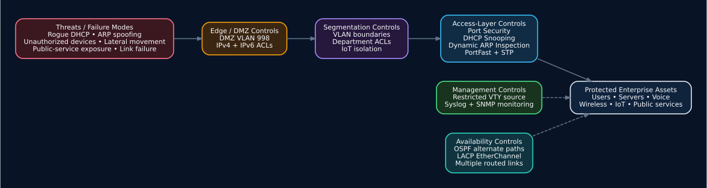
</p>

I did not rely on one security feature. The design uses **defense in depth**: different controls address different attack paths.

### Threat-to-control matrix

| Threat / risk | Control in this project | Why it helps | Production extension |
| --- | --- | --- | --- |
| User-to-user lateral movement | VLAN segmentation + routed ACLs | Forces sensitive traffic through policy boundaries | Identity-based microsegmentation / VRF / SGT |
| Rogue DHCP server | DHCP snooping on VLANs 107–108 | Blocks DHCP server replies from untrusted access ports | NAC + switch policy + monitoring |
| ARP spoofing / poisoning | Dynamic ARP Inspection | Validates ARP against trusted bindings | IP Source Guard + NAC + endpoint security |
| Unauthorized device on HR/Finance port | Sticky MAC port security | Limits learned MACs and restricts violations | 802.1X/MAB + NAC |
| Compromised public server | DMZ VLAN + ACL | Reduces direct initiation from DMZ into internal networks | NGFW + IPS + WAF + EDR |
| IoT compromise | Dedicated IoT networks + intended IoT ACL | Separates lower-trust smart devices | IoT profiling + microsegmentation |
| Broadcast loop | STP/PVST | Prevents Layer-2 loops | RSTP/MST, routed access or fabric edge |
| Single uplink failure | LACP EtherChannel | One member can fail while channel remains available | Dual-homing / MLAG / StackWise / redundant switches |
| Routed-link failure | OSPF mesh | Dynamic routing can select another path | ECMP, dual core, BFD, SD-WAN/fabric |
| Uncontrolled management access | VTY source restriction on Router4 | Limits permitted management source | SSH only + AAA + management VRF + PAM |
| Lack of visibility | Syslog/SNMP | Creates operational telemetry | SIEM + streaming telemetry + NDR/XDR |
| IPv6 policy gap | IPv6 ACL on VLAN 116 | Applies security to IPv6 traffic | Full IPv6 firewall/NAC/RA Guard/DHCPv6 Guard |

### HR and Finance ACL design

Router3 applies inbound ACLs on VLANs 107 and 108. The rules explicitly permit access to required server/CEO destinations and DHCP traffic. This is closer to a least-privilege model than simply allowing every internal network to reach every other internal network.

### `CEO_AND_SERVER_ONLY`

This policy controls traffic toward the HR/Finance segments from trusted server/CEO ranges. It demonstrates that access control must consider traffic direction, not only source VLAN membership.

### DMZ policy

The DMZ ACL prevents unrestricted new sessions from the DMZ into the private `10.0.0.0/8` environment while allowing established TCP return traffic.

### Security boundary model

I treat the following as separate trust zones:

1. ordinary employee networks;
2. sensitive HR/Finance networks;
3. technical/NOC/Cybersecurity networks;
4. core services;
5. voice infrastructure;
6. wireless management;
7. IoT;
8. operations/monitoring;
9. DMZ/public services;
10. IPv6 R&D.

That trust-zone thinking is more important than any single ACL command because it is the basis for scalable enterprise policy.

---

## End-to-end traffic flows

<p align="center">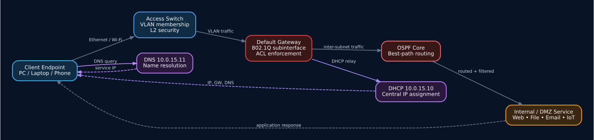</p>

### Example 1 — Finance workstation gets an IP address

1. The workstation is connected to a Switch11 access port in VLAN 108.
2. The client broadcasts DHCP Discover.
3. DHCP snooping checks that server responses do not originate from an untrusted access port.
4. Router3 receives the request on `GigabitEthernet0/1.108`.
5. `ip helper-address 10.0.15.10` relays the request to the central DHCP server.
6. The `FinanceData108` scope supplies a `10.0.108.x` address, gateway `10.0.108.1` and DNS `10.0.15.11`.
7. The client can now use routed services according to the Finance ACL policy.

### Example 2 — Employee opens an internal site

1. The client queries `10.0.15.11` for `nova.local`.
2. DNS returns `10.0.15.12`.
3. The client sends web traffic to its default gateway.
4. OSPF provides reachability toward Router0/core services.
5. The web server replies through the routed network.

### Example 3 — IP phone boots

1. The phone is placed into voice VLAN 80 (or the appropriate voice VLAN at the access edge).
2. DHCP supplies voice addressing and can provide the `10.2.80.2` CME/TFTP-side address.
3. The phone reaches Router7 / `Campus_Voice_Gateway`.
4. CME provides configured directory-number/call-control functions.
5. The PC behind the phone remains logically separated in its data VLAN.

### Example 4 — CEO wireless client

1. The lightweight AP is managed through the WLC network on VLAN 110.
2. The controller hosts the `CEO_Network` / `CEO_WIFI` WLAN profile.
3. Wireless infrastructure uses gateway `10.0.110.1` and central DNS `10.0.15.11`.
4. Client/application traffic is routed into the enterprise according to the relevant policy.

### Example 5 — DMZ server tries to initiate internal access

1. The DMZ host originates traffic from `10.0.254.0/24`.
2. Router5 evaluates `DMZ_SECURITY`.
3. Established TCP return traffic toward internal networks can pass.
4. New general DMZ-to-internal IP traffic is denied.
5. This reduces the blast radius if a public server is compromised.

---

## Availability and resiliency

Availability is addressed at multiple layers, although the lab is not a fully redundant production deployment.

### Routed resilience

The OSPF core has multiple inter-router connections. This demonstrates that a path can change without manually editing static routes everywhere.

### Layer-2 link resilience

The Switch3–Switch4 EtherChannel bundles eight physical links into one logical channel. Loss of a member link does not necessarily remove the entire logical path.

### Segmentation as failure containment

VLANs do more than provide security. They also constrain broadcasts and some Layer-2 faults to a smaller part of the enterprise.

### Remaining single points of failure

The project still contains production-relevant single points of failure:

- one central DHCP server;
- one central DNS server;
- one WLC;
- one voice gateway;
- single access/distribution switches in several zones;
- single router gateways for many VLANs;
- no HSRP/VRRP/GLBP first-hop redundancy;
- no redundant firewall pair.

These are appropriate next steps if the design is evolved from a learning/portfolio enterprise lab into a high-availability production architecture.

---

## Why each technology is used

| Technology | Why I used it | Real enterprise value | What happens without it |
| --- | --- | --- | --- |
| VLANs | Split departments/trust zones | Smaller broadcast domains and policy boundaries | Flat network, more broadcast and lateral movement |
| 802.1Q trunking | Carry many VLANs on one uplink | Efficient access/distribution connectivity | One physical link needed per VLAN |
| Router-on-a-stick | Demonstrate inter-VLAN routing with available routers | Clear Layer-3 policy boundary; useful in small sites/labs | VLANs cannot communicate across subnets |
| OSPF | Dynamic core routing | Automatic route exchange and reconvergence | Large static-route maintenance burden |
| `/30` transit addressing | Point-to-point router links | Clear efficient transit subnets | Wasted address space / ambiguous design |
| Central DHCP | One source of address policy | Consistent scopes, gateways and DNS | Manual IPs or many independent DHCP servers |
| `ip helper-address` | Cross Layer-3 boundaries | Lets central DHCP serve remote VLANs | DHCP broadcasts stop at routers |
| DNS | Name-to-IP resolution | Stable service names and easier operations | Users/apps depend on raw IP addresses |
| Core-services VLAN | Separate servers from clients | Protects critical shared infrastructure | Servers share failure/security domain with users |
| DMZ | Isolate public services | Limits blast radius from internet-facing systems | Public servers sit directly beside internal assets |
| Extended ACLs | Enforce source/destination policy | Basic least-privilege segmentation | Any routed network can reach any other routed network |
| IPv6 ACL | Apply policy to IPv6 | Avoids an IPv6 security bypass | IPv4 can be secured while IPv6 stays open |
| Port security | Limit unknown access devices | Basic edge hardening | Any device can use an open switch port |
| DHCP snooping | Stop rogue DHCP | Protects gateway/DNS assignment | Attacker can redirect clients with fake DHCP |
| Dynamic ARP Inspection | Reduce ARP spoofing | Protects local L2 traffic integrity | ARP poisoning can redirect traffic |
| STP/PVST | Prevent L2 loops | Protects network from broadcast storms | Redundant cabling can melt down the LAN |
| PortFast | Accelerate endpoint connectivity | Faster boot/login for edge devices | Endpoints wait through STP states |
| LACP EtherChannel | Bundle parallel links | More bandwidth + link resiliency | STP may block parallel links / one link bottleneck |
| Voice VLAN | Separate phone traffic | Easier QoS, policy and provisioning | Voice/data share same broadcast/policy domain |
| Cisco CME | Local call-control lab | Models PBX/call-control behavior | IP phones have no central call control |
| WLC + LAP | Central wireless control | Consistent SSID/security/RF operations | Each AP is configured independently |
| IoT VLANs | Isolate lower-trust devices | Limits IoT compromise impact | Smart devices can freely reach user/server networks |
| Syslog | Central event collection | Troubleshooting and audit trail | Events remain only on individual devices |
| SNMP | Device monitoring model | Health/status visibility | Operations team has limited infrastructure visibility |

---

## How this differs from a flat network

A small unmanaged office might place every system in one subnet behind one gateway. That is easier to configure but becomes dangerous and difficult to operate as the company grows.

| Flat / basic network | This project |
| --- | --- |
| One or very few subnets | Many department/service trust zones |
| Minimal traffic control | ACL-controlled routed boundaries |
| DHCP local to one LAN | Central DHCP across routed VLANs |
| Public/internal systems mixed | Dedicated DMZ |
| No dedicated voice design | Voice VLAN + CME |
| Standalone Wi-Fi | WLC + lightweight AP |
| IoT mixed with users | Dedicated IoT networks |
| One routed path | Dense OSPF core |
| Parallel links can be blocked or loop | LACP EtherChannel + STP |
| Little access-edge security | Port security + DHCP snooping + DAI |
| Little monitoring | Operations subnet + syslog/SNMP model |

The major difference is **intentional separation**. Instead of thinking only about connectivity, the design also considers who should communicate, where services belong, how a failure is contained and where security policy should be enforced.

---

## How this compares with modern enterprise architecture

<p align="center">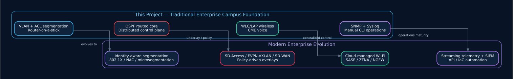</p>

This project is best described as a **traditional enterprise campus foundation**. The core ideas are still relevant, but modern production networks often add controller-based policy, identity, automation and cloud security on top.

| Area | This project | Common modern enterprise evolution | Relationship |
| --- | --- | --- | --- |
| Campus segmentation | VLANs + ACLs | VRFs, SD-Access virtual networks, SGT/microsegmentation | Same goal, more scalable policy model |
| Routing | OSPF core | OSPF/IS-IS underlay + SD-Access, EVPN/VXLAN or controller policy | OSPF remains useful as an underlay/IGP |
| WAN | Routed lab core | SD-WAN with application-aware path policy | Adds centralized WAN control |
| Access control | Port security | 802.1X/MAB + NAC/ISE-style identity | Moves from MAC limits to identity/posture |
| Perimeter | Router ACL + DMZ | NGFW, IPS, WAF, ZTNA, SASE/SSE | Deeper application/user-aware inspection |
| Wireless | WLC + LAP | Cloud/controller-managed Wi-Fi 6E/7 + WPA3-Enterprise | Same centralized-control idea with newer radio/security |
| Monitoring | SNMP + syslog | Streaming telemetry, NetFlow/IPFIX, SIEM, NDR/XDR | More data, correlation and automation |
| Configuration | Manual CLI | Ansible/IaC, APIs, source-controlled templates | Reduces drift and manual error |
| Services | Mostly on-prem lab servers | Hybrid cloud/SaaS + resilient DNS/DHCP/IPAM | Same service functions, different delivery model |
| Voice | Local CME | Cloud calling / centralized UC / SIP | Same voice/data separation principles |
| IoT | Separate VLAN + ACL | Device profiling, NAC, microsegmentation | Identity and dynamic policy improve isolation |
| IPv6 | Dedicated IPv6 segment | Dual-stack/IPv6-first with equal security controls | Extends IPv6 policy across the enterprise |
| High availability | Route/path redundancy | Dual core, FHRP, HA firewalls/controllers/services | Removes remaining single points of failure |

### What is still directly relevant today

The following ideas do **not** become obsolete just because a company uses SD-WAN, SASE or a campus fabric:

- good IP addressing;
- segmentation;
- an underlay routing protocol;
- redundancy;
- access-layer protections;
- central services;
- DNS/DHCP correctness;
- visibility and logging;
- separating public, user, management, voice and IoT trust zones.

Modern platforms automate and scale these principles; they do not remove the need to understand them.

---

## Production hardening roadmap

If I were converting this topology into a production enterprise design, I would evolve it in phases.

### Phase 1 — Correct the saved-state inconsistencies

1. Normalize the five Router0 transit links to the correct `/30` masks.
2. Attach and validate the `IOT_RESTRICTED` ACL.
3. Correct the IoT DHCP DNS address to `10.0.15.11`.
4. Clear duplicate/stale DHCP leases.
5. Remove duplicate sticky MAC entries.
6. Resolve Switch15 Fa0/5 as either a trunk or access port—not both.
7. Standardize VLAN names/numbers and interface descriptions.

### Phase 2 — Strengthen device management

1. SSH-only management.
2. AAA using TACACS+/RADIUS.
3. Named admin accounts with strong secrets.
4. Management VRF or dedicated out-of-band network.
5. SNMPv3 instead of community-based SNMP.
6. NTP on every infrastructure device.
7. Central configuration backup and version control.
8. Role-based administrative access.

### Phase 3 — Strengthen access security

1. 802.1X for managed endpoints.
2. MAB for phones/printers/IoT that cannot use 802.1X.
3. NAC policy by device/user identity.
4. IP Source Guard.
5. BPDU Guard on edge ports.
6. Storm control.
7. Disable/shutdown unused ports and place them in an unused VLAN.

### Phase 4 — Add real perimeter security

1. Redundant NGFW pair.
2. NAT and explicit inbound/outbound policy.
3. IDS/IPS.
4. WAF/reverse proxy for the public web service.
5. Secure mail gateway or cloud email security.
6. DDoS protection.
7. TLS certificate lifecycle management.

### Phase 5 — Remove single points of failure

1. Dual core/distribution devices.
2. HSRP/VRRP first-hop redundancy.
3. Redundant DHCP/DNS.
4. HA WLC or cloud-managed wireless.
5. Redundant voice/call-control platform.
6. Dual-homed access switches where business-critical.
7. Redundant power/uplinks.

### Phase 6 — Modernize operations

1. SIEM integration.
2. NetFlow/IPFIX or streaming telemetry.
3. Automated configuration compliance.
4. Network source-of-truth/IPAM.
5. Infrastructure-as-Code / Ansible-style deployment.
6. Continuous backup and drift detection.
7. Synthetic reachability and application monitoring.

### Phase 7 — Move toward identity / zero-trust policy

1. Replace broad IP-based trust with identity-aware policy.
2. Use ZTNA for remote/private application access.
3. Use SASE/SSE where business requirements justify it.
4. Microsegment high-value systems.
5. Apply device posture and continuous authentication.

---

## Known saved-state issues

I keep known issues in the repository because an engineering project should document what remains to be corrected rather than hiding it.

| Severity | Finding | What I would do |
| --- | --- | --- |
| High | Transit subnet-mask inconsistency | Five Router0-facing point-to-point links use `/24` on Router0 while the peer side uses `/30`. I would normalize these to `/30` before production. |
| High | Raw lab secrets exist inside the Packet Tracer file | The project stores wireless/email/SNMP credential material. I keep secret values out of the public Markdown/config copies and would rotate any value reused elsewhere. |
| Medium | IoT ACL defined but not attached | `IOT_RESTRICTED` exists on Router3 but is not applied with `ip access-group` in the saved running configuration. The intended isolation policy is stronger than the current enforcement. |
| Medium | Switch15 access/trunk intent conflict | FastEthernet0/5 has an access VLAN configured while the interface operates as a trunk. I would correct the role to one unambiguous mode. |
| Medium | IoT DHCP DNS value needs correction | The `Iot devices` pool distributes `10.0.15.12` as DNS even though the dedicated DNS server is `10.0.15.11`. |
| Medium | Duplicate saved DHCP lease | `10.0.100.50` appears with more than one MAC in the saved lease database. I would clear stale bindings and retest uniqueness. |
| Medium | Duplicate sticky MAC entries on Switch11 | Several sticky MAC values appear on more than one access port; these should be cleaned so a MAC is bound only where intended. |
| Medium | SNMPv2-style community | Router4 uses community-based SNMP. A production design should use SNMPv3 or secure streaming telemetry. |
| Low | IOS password encryption disabled | The saved IOS configs contain `no service password-encryption`. In production I would use proper secrets/AAA and avoid treating reversible IOS obfuscation as real protection. |

### Transit mask mismatch details

The intended point-to-point design is `/30`, but Router0 currently has `/24` masks on these links while peers use `/30`:

- Router0 `Serial0/1/0 10.0.25.2/24` ↔ Router2 `10.0.25.1/30`
- Router0 `Serial0/1/1 10.0.21.2/24` ↔ Router1 `10.0.21.1/30`
- Router0 `Serial0/0/0 10.0.20.2/24` ↔ Router4 `10.0.20.1/30`
- Router0 `Serial0/0/1 10.0.30.2/24` ↔ Router5 `10.0.30.1/30`
- Router0 `GigabitEthernet0/0 10.0.28.2/24` ↔ Router3 `10.0.28.1/30`

These addresses can still appear to communicate because the host portions overlap, but inconsistent masks create ambiguous network assumptions and should be fixed.

---

## Implementation journey

The Packet Tracer project contains **3,426 saved command-history records** across multiple build/troubleshooting sessions. The project evolved incrementally rather than appearing as one finished topology.

| Date / phase | Main work represented in the project history |
| --- | --- |
| Jun 10–11 | Initial router addressing, core links and first OSPF configuration |
| Jun 11–16 | Corporate VLANs for Execs, HR, Finance, Sales and IT Helpdesk |
| Jun 19 | `/30` core-link refinement, DHCP relay work, trunks and routing verification |
| Jun 23 | IoT VLAN 100 and central IoT DHCP-relay work |
| Jun 25–26 | Cloud Infrastructure, Software Engineering, Cybersecurity, NOC and voice VLANs; voice gateway/CME build |
| Jun 30 | Voice troubleshooting, Sales networks, DMZ-side switching and additional routed networks |
| Jul 03 | HR/Finance VLANs, strict ACLs, port-security work and sensitive-department segmentation |
| Jul 06–07 | CEO data, WLC management, wireless/LAP integration and trunk refinement |
| Jul 26 | CEO IoT and `IOT_RESTRICTED` policy work |
| Jul 27 | Media VLAN, LACP EtherChannel, DMZ, IPv6 R&D, monitoring VLAN and final hardening/configuration work |

An intermediate `Router6` appears in 49 historical command records but not in the final topology. It represents an earlier voice-gateway iteration before the final `Router7 / Campus_Voice_Gateway` state.

For the complete timeline see [`docs/IMPLEMENTATION_TIMELINE.md`](docs/IMPLEMENTATION_TIMELINE.md). The complete saved CLI history is in [`docs/COMMAND_HISTORY_FULL.md`](docs/COMMAND_HISTORY_FULL.md).

---

## Validation and test approach

I use a combination of configuration review and Packet Tracer verification commands to validate the design.

### Routing tests

```text
show ip interface brief
show ip route
show ip ospf neighbor
show ip protocols
ping <remote-gateway-or-host>
traceroute <remote-host>
```

Expected result: every required subnet has a route, OSPF paths are learned as expected, and alternate connectivity can be tested after disabling a link.

### VLAN/trunk tests

```text
show vlan brief
show interfaces trunk
show interfaces switchport
show spanning-tree
```

Expected result: access ports are in the intended VLAN, trunks carry only required VLANs, and STP has a loop-free topology.

### EtherChannel tests

```text
show etherchannel summary
show interfaces port-channel 1
```

Expected result: member links form one LACP channel and the port-channel carries the intended VLANs.

### DHCP tests

```text
show ip dhcp binding
show ip dhcp conflict
```

Client-side checks:

- renew DHCP lease;
- verify IP/mask/gateway/DNS;
- verify the lease belongs to the correct subnet;
- test DNS resolution and routed reachability.

### ACL tests

```text
show access-lists
show running-config | section access-list
```

I would test both **allowed and denied** flows. A security control is not proven by checking only traffic that should pass.

### Access-layer security tests

```text
show port-security
show port-security interface <interface>
show ip dhcp snooping
show ip arp inspection
```

Test cases include a rogue DHCP attempt, a MAC change/extra device on a secured port and ARP behavior inside the protected VLAN.

### Voice tests

```text
show running-config | section telephony-service
show ephone registered
show ephone-dn
```

Then verify that phones obtain addressing/provisioning and can call configured extensions.

### Wireless tests

- verify WLC management connectivity;
- verify LAP registration;
- verify SSID visibility;
- connect a wireless client;
- check DHCP/DNS/routed access from wireless.

### DMZ tests

- internal → DMZ/public service should work where intended;
- established return traffic should work;
- new DMZ → internal access should be denied by policy;
- IPv6 VLAN 116 traffic should follow the IPv6 ACL.

---

## Skills demonstrated

This project demonstrates practical knowledge across several networking domains:

### Routing

- IPv4 subnetting and point-to-point networks
- OSPF Area 0
- router IDs and route advertisement
- default routing
- routing-table troubleshooting
- DHCP relay across Layer 3
- IPv6 addressing/filtering

### Switching

- VLAN design
- access/trunk ports
- 802.1Q
- voice VLANs
- PVST/STP
- PortFast
- LACP EtherChannel
- Layer-2 troubleshooting

### Network services

- DHCP scope design
- DNS records
- web/file/email service placement
- server addressing
- IoT registration

### Security

- extended ACLs
- DMZ segmentation
- IPv6 ACL
- port security
- DHCP snooping
- Dynamic ARP Inspection
- management-source restriction
- trust-zone design

### Unified communications

- Cisco CME
- directory numbers/ephones
- voice VLAN
- phone + PC access design
- TFTP/CME-side DHCP options

### Wireless

- controller-based architecture
- WLC management
- lightweight AP
- enterprise SSID design
- dedicated wireless-management VLAN

### Operations

- syslog
- SNMP concepts
- NOC/monitoring segmentation
- configuration verification
- iterative troubleshooting from CLI history

---

## Repository structure

```text
.
├── README.md
├── jesowin project.pkt                 # Packet Tracer project (already in repository)
├── assets/
│   ├── hero-banner.svg
│   ├── badges/                         # Local GitHub badges
│   ├── screenshots/                    # Full topology + subsystem topology snapshots
│   └── architecture/                   # Layered, security, traffic, resilience and comparison diagrams
├── docs/
│   ├── ARCHITECTURE.md
│   ├── DEVICE_INVENTORY.md
│   ├── CONFIGURATION_REFERENCE.md
│   ├── SERVICES_WIRELESS_VOICE_IOT.md
│   ├── IMPLEMENTATION_TIMELINE.md
│   ├── COMMAND_HISTORY_FULL.md
│   ├── VALIDATION_AND_FINDINGS.md
│   └── EVIDENCE_METADATA.md
├── configs/
│   ├── Router0.cfg ... Router7.cfg
│   └── Switch0.cfg ... Switch16.cfg
└── data/
    ├── analysis_summary.json
    ├── device_inventory.csv
    ├── link_inventory.csv
    └── command_history_sanitized.csv
```

### Documentation map

- **[`docs/ARCHITECTURE.md`](docs/ARCHITECTURE.md)** — routed interfaces, VLAN termination, direct router links and architecture details.
- **[`docs/DEVICE_INVENTORY.md`](docs/DEVICE_INVENTORY.md)** — complete device and physical/logical link inventory.
- **[`docs/CONFIGURATION_REFERENCE.md`](docs/CONFIGURATION_REFERENCE.md)** — per-device configuration explanation plus public-safe IOS configuration copies.
- **[`docs/SERVICES_WIRELESS_VOICE_IOT.md`](docs/SERVICES_WIRELESS_VOICE_IOT.md)** — detailed DHCP/DNS/server/wireless/voice/IoT data.
- **[`docs/IMPLEMENTATION_TIMELINE.md`](docs/IMPLEMENTATION_TIMELINE.md)** — full project build/troubleshooting timeline.
- **[`docs/COMMAND_HISTORY_FULL.md`](docs/COMMAND_HISTORY_FULL.md)** — the full saved CLI command record.
- **[`docs/VALIDATION_AND_FINDINGS.md`](docs/VALIDATION_AND_FINDINGS.md)** — configuration review and hardening items.
- **[`configs/`](configs/)** — router/switch running-config references with secret-bearing values omitted from the public copies.
- **[`data/`](data/)** — CSV/JSON inventories for analysis or automation.

---

## Opening and reviewing the project

1. Install Cisco Packet Tracer compatible with the project format.
2. Clone/download this repository.
3. Open `jesowin project.pkt`.
4. Start with the Logical workspace and compare it with the full topology image in this README.
5. Inspect Router0–Router5 to understand the OSPF core.
6. Inspect Router1/2/3/4/5 LAN-facing interfaces to understand the VLAN groups.
7. Open Switch11 to study access-layer security.
8. Open Switch3/Switch4 to study LACP EtherChannel.
9. Open Router7 to study CME voice configuration.
10. Open the WLC and LAP to study centralized wireless.
11. Open the DHCP/DNS/Web/File servers to understand centralized infrastructure.
12. Test allowed/blocked traffic in Simulation mode.

### Suggested reading order

For someone reviewing the project for the first time:

1. read this `README.md` completely;
2. open [`assets/screenshots/01-full-project-topology.png`](assets/screenshots/01-full-project-topology.png);
3. review [`docs/ARCHITECTURE.md`](docs/ARCHITECTURE.md);
4. review [`docs/SERVICES_WIRELESS_VOICE_IOT.md`](docs/SERVICES_WIRELESS_VOICE_IOT.md);
5. inspect selected configs in [`configs/`](configs/);
6. use [`docs/VALIDATION_AND_FINDINGS.md`](docs/VALIDATION_AND_FINDINGS.md) as the improvement checklist;
7. open the `.pkt` and reproduce the tests.

---

## Project conclusion

This project represents my attempt to model the **networking responsibilities of a real enterprise IT environment** in one Packet Tracer topology. It goes beyond basic connectivity by combining business segmentation, routing resiliency, central infrastructure, voice, wireless, IoT, public services, monitoring and multiple security controls.

The most important design lesson is that an enterprise network is not only about making devices communicate. A good network must also answer:

- **Which devices belong together?**
- **Which networks should be separated?**
- **Where should policy be enforced?**
- **How do clients find and reach shared services?**
- **What happens when a link fails?**
- **How are public systems isolated?**
- **How do we prevent local attacks such as rogue DHCP and ARP spoofing?**
- **How do voice, wireless and IoT fit into the same infrastructure without becoming one flat trust domain?**
- **How can an operations team observe and troubleshoot the environment?**
- **How would the architecture evolve toward identity, automation, HA and zero-trust controls in production?**

The topology therefore serves both as a networking implementation and as a foundation for understanding how traditional enterprise campus concepts evolve into modern secure enterprise architecture.
